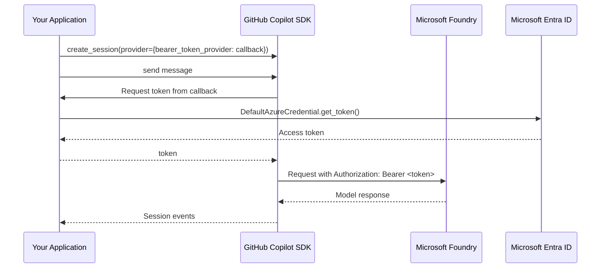

# Azure Managed Identity with BYOK

The GitHub Copilot SDK's [BYOK mode](../auth/byok.md) supports static API keys, but Azure deployments often use **Managed Identity** (Microsoft Entra ID) instead of long-lived keys. The GitHub Copilot SDK is designed to compose with the Azure Identity SDK for maximum flexibility. Supply a bearer token provider callback that can fetch fresh tokens on demand using an Azure Identity SDK API.

This guide shows how to use Azure Identity SDK APIs to authenticate with Microsoft Foundry models through the GitHub Copilot SDK. Most languages use `DefaultAzureCredential`; Rust uses `DeveloperToolsCredential` locally and `ManagedIdentityCredential` in Azure.

## How it works

Microsoft Foundry's OpenAI-compatible endpoint (`https://<resource-name>.openai.azure.com/openai/v1/`) accepts bearer tokens from Microsoft Entra ID in place of static API keys. This guide uses a token provider callback so the GitHub Copilot SDK runtime can request fresh tokens on demand.

Using Python as an example, the flow is:

1. Configure `DefaultAzureCredential` for your environment.
1. Pass a callback, in `bearer_token_provider` of the BYOK provider configuration, that uses `DefaultAzureCredential` to obtain a token for the `https://ai.azure.com/.default` scope.
1. Let the GitHub Copilot SDK request fresh tokens on demand through that callback.



## Code samples

### Prerequisites

Install the Azure Identity and GitHub Copilot SDK packages for your language:

<details open>
<summary><strong>.NET</strong></summary>

<!-- docs-validate: skip -->

```bash
dotnet add package GitHub.Copilot.SDK
dotnet add package Azure.Core
```

</details>
<details>
<summary><strong>Go</strong></summary>

<!-- docs-validate: skip -->

```bash
go get github.com/github/copilot-sdk/go
go get github.com/Azure/azure-sdk-for-go/sdk/azidentity
```

</details>
<details>
<summary><strong>Java</strong></summary>

<!-- docs-validate: skip -->

```xml
<dependency>
    <groupId>com.github</groupId>
    <artifactId>copilot-sdk-java</artifactId>
    <version>${copilot.sdk.version}</version>
</dependency>

<dependency>
    <groupId>com.azure</groupId>
    <artifactId>azure-identity</artifactId>
    <version>${azure.identity.version}</version>
</dependency>
```

</details>
<details>
<summary><strong>Python</strong></summary>

<!-- docs-validate: skip -->

```bash
pip install github-copilot-sdk azure-identity
```

</details>
<details>
<summary><strong>Rust</strong></summary>

<!-- docs-validate: skip -->

```bash
cargo add github-copilot-sdk azure_identity azure_core
cargo add tokio --features macros,rt-multi-thread
```

</details>
<details>
<summary><strong>TypeScript</strong></summary>

<!-- docs-validate: skip -->

```bash
npm install @github/copilot-sdk @azure/identity
```

</details>

### Use a token provider callback

Use this approach when you want the GitHub Copilot SDK runtime to request fresh tokens on demand through a callback that you provide. The Azure Identity SDK handles token caching and refresh timing.

Here are language-specific implementations:

<details open>
<summary><strong>.NET</strong></summary>

<!-- docs-validate: skip -->

```csharp
using Azure.Core;
using Azure.Identity;
using GitHub.Copilot;

DefaultAzureCredential credential = new(
    DefaultAzureCredential.DefaultEnvironmentVariableName);
await using CopilotClient client = new();
string foundryUrl = Environment.GetEnvironmentVariable("FOUNDRY_RESOURCE_URL")!;

await using CopilotSession session = await client.CreateSessionAsync(new SessionConfig
{
    Model = "gpt-5.5",
    Provider = new ProviderConfig
    {
        Type = "openai",
        BaseUrl = $"{foundryUrl}/openai/v1/",
        BearerTokenProvider = async _ =>
        {
            AccessToken token = await credential.GetTokenAsync(
                new TokenRequestContext(["https://ai.azure.com/.default"]));
            return token.Token;
        },
        WireApi = "responses",
    },
});

AssistantMessageEvent? response = await session.SendAndWaitAsync(
    new MessageOptions { Prompt = "Hello from Managed Identity!" });
Console.WriteLine(response?.Data.Content);
```

</details>
<details>
<summary><strong>Go</strong></summary>

<!-- docs-validate: skip -->

```go
package main

import (
	"context"
	"fmt"
	"log"
	"os"
	"time"

	"github.com/Azure/azure-sdk-for-go/sdk/azcore/policy"
	"github.com/Azure/azure-sdk-for-go/sdk/azidentity"
	copilot "github.com/github/copilot-sdk/go"
)
func main() {
	opts := azidentity.DefaultAzureCredentialOptions{RequireAzureTokenCredentials: true}
	credential, err := azidentity.NewDefaultAzureCredential(&opts)
	if err != nil {
		log.Fatal(err)
	}

	getBearerToken := func(args copilot.ProviderTokenArgs) (string, error) {
		token, err := credential.GetToken(context.Background(), policy.TokenRequestOptions{
			Scopes: []string{"https://ai.azure.com/.default"},
		})
		if err != nil {
			return "", err
		}
		return token.Token, nil
	}

	client := copilot.NewClient(nil)
	if err := client.Start(context.Background()); err != nil {
		log.Fatal(err)
	}
	defer client.Stop()

	foundryURL := os.Getenv("FOUNDRY_RESOURCE_URL")

	session, err := client.CreateSession(context.Background(), &copilot.SessionConfig{
		Model: "gpt-5.5",
		Provider: &copilot.ProviderConfig{
			Type:                "openai",
			BaseURL:             fmt.Sprintf("%s/openai/v1/", foundryURL),
			BearerTokenProvider: getBearerToken,
			WireAPI:             "responses",
		},
	})
	if err != nil {
		log.Fatal(err)
	}
	defer session.Disconnect()

	ctx, cancel := context.WithTimeout(context.Background(), 60*time.Second)
	defer cancel()

	response, err := session.SendAndWait(ctx, copilot.MessageOptions{
		Prompt: "Hello from Managed Identity!",
	})
	if err != nil {
		log.Fatal(err)
	}

	if response != nil {
		if data, ok := response.Data.(*copilot.AssistantMessageData); ok {
			fmt.Println(data.Content)
		}
	}
}
```

</details>
<details>
<summary><strong>Java</strong></summary>

<!-- docs-validate: skip -->

```java
import com.azure.core.credential.TokenRequestContext;
import com.azure.identity.AzureIdentityEnvVars;
import com.azure.identity.DefaultAzureCredentialBuilder;
import com.github.copilot.CopilotClient;
import com.github.copilot.generated.AssistantMessageEvent;
import com.github.copilot.rpc.BearerTokenProvider;
import com.github.copilot.rpc.MessageOptions;
import com.github.copilot.rpc.ProviderConfig;
import com.github.copilot.rpc.SessionConfig;

public class ManagedIdentityExample {
    public static void main(String[] args) throws Exception {
        var credential = new DefaultAzureCredentialBuilder()
                .requireEnvVars(AzureIdentityEnvVars.AZURE_TOKEN_CREDENTIALS)
                .build();
        BearerTokenProvider tokenProvider = providerArgs ->
            credential
                .getToken(new TokenRequestContext().addScopes("https://ai.azure.com/.default"))
                .map(accessToken -> accessToken.getToken())
                .toFuture();
        String foundryUrl = System.getenv("FOUNDRY_RESOURCE_URL");

        try (var client = new CopilotClient()) {
            client.start().get();

            var session = client.createSession(new SessionConfig()
                    .setModel("gpt-5.5")
                    .setProvider(new ProviderConfig()
                            .setType("openai")
                            .setBaseUrl(foundryUrl + "/openai/v1/")
                            .setBearerTokenProvider(tokenProvider)
                            .setWireApi("responses")))
                .get();

            AssistantMessageEvent response = session
                    .sendAndWait(new MessageOptions().setPrompt("Hello from Managed Identity!"))
                    .get();
            System.out.println(response.getData().content());

            session.disconnect().get();
        }
    }
}
```

</details>
<details>
<summary><strong>Python</strong></summary>

<!-- docs-validate: skip -->

```python
import asyncio
import os

from azure.identity.aio import DefaultAzureCredential
from copilot import CopilotClient
from copilot.session import PermissionHandler, ProviderConfig

async def main():
    credential = DefaultAzureCredential(require_envvar=True)
    async def get_bearer_token(_args) -> str:
        token = await credential.get_token("https://ai.azure.com/.default")
        return token.token

    foundry_url = os.environ["FOUNDRY_RESOURCE_URL"]

    client = CopilotClient()
    await client.start()

    session = await client.create_session(
        on_permission_request=PermissionHandler.approve_all,
        model="gpt-5.5",
        provider=ProviderConfig(
            type="openai",
            base_url=f"{foundry_url.rstrip('/')}/openai/v1/",
            bearer_token_provider=get_bearer_token,
            wire_api="responses",
        ),
    )

    response = await session.send_and_wait("Hello from Managed Identity!")
    print(response.data.content)

    await client.stop()
    await credential.close()


asyncio.run(main())
```

</details>
<details>
<summary><strong>Rust</strong></summary>

<!-- docs-validate: skip -->

```rust
use std::sync::Arc;

use azure_core::credentials::TokenCredential;
use azure_identity::{DeveloperToolsCredential, ManagedIdentityCredential};
use github_copilot_sdk::{BearerTokenError, Client, ClientOptions, MessageOptions, ProviderTokenArgs};
use github_copilot_sdk::types::{ProviderConfig, SessionConfig};

fn credential_for_environment() -> azure_core::Result<Arc<dyn TokenCredential>> {
    match std::env::var("AZURE_TOKEN_CREDENTIALS").as_deref() {
        Ok("ManagedIdentityCredential") => Ok(ManagedIdentityCredential::new(None)?),
        _ => Ok(DeveloperToolsCredential::new(None)?),
    }
}

#[tokio::main]
async fn main() -> Result<(), Box<dyn std::error::Error>> {
    let credential = credential_for_environment()?;
    let foundry_url = std::env::var("FOUNDRY_RESOURCE_URL")?;

    let get_bearer_token = {
        let credential = credential.clone();
        move |_args: ProviderTokenArgs| {
            let credential = credential.clone();
            async move {
                let token = credential
                    .get_token(&["https://ai.azure.com/.default"], None)
                    .await
                    .map_err(|err| BearerTokenError::message(err.to_string()))?;
                Ok(token.token.secret().to_string())
            }
        }
    };

    let mut provider = ProviderConfig::default();
    provider.provider_type = Some("openai".to_string());
    provider.base_url = format!("{}/openai/v1/", foundry_url.trim_end_matches('/'));
    provider.bearer_token_provider = Some(Arc::new(get_bearer_token));
    provider.wire_api = Some("responses".to_string());

    let mut config = SessionConfig::default();
    config.model = Some("gpt-5.5".to_string());
    config.provider = Some(provider);

    let client = Client::start(ClientOptions::default()).await?;
    let session = client.create_session(config).await?;

    session
        .send_and_wait(MessageOptions::new("Hello from Managed Identity!"))
        .await?;

    session.disconnect().await?;
    client.stop().await?;
    Ok(())
}
```

</details>
<details>
<summary><strong>TypeScript</strong></summary>

<!-- docs-validate: skip -->

```typescript
import { DefaultAzureCredential } from "@azure/identity";
import { CopilotClient } from "@github/copilot-sdk";

const credential = new DefaultAzureCredential({
  requiredEnvVars: ["AZURE_TOKEN_CREDENTIALS"],
});
const getBearerToken = async () => {
  const tokenResponse = await credential.getToken("https://ai.azure.com/.default");
  return tokenResponse.token;
};

const client = new CopilotClient();

const session = await client.createSession({
  model: "gpt-5.5",
  provider: {
    type: "openai",
    baseUrl: `${process.env.FOUNDRY_RESOURCE_URL}/openai/v1/`,
    bearerTokenProvider: getBearerToken,
    wireApi: "responses",
  },
});

const response = await session.sendAndWait({ prompt: "Hello from Managed Identity!" });
console.log(response?.data.content);

await client.stop();
```

</details>

## Environment configuration

| Variable | Description | Example |
|----------|-------------|---------|
| `AZURE_TOKEN_CREDENTIALS` | When running in **Azure**, set it to `ManagedIdentityCredential`. When running **locally**, set it to either `dev` or a developer tool credential name, such as `AzureCliCredential`. | `ManagedIdentityCredential` |
| `AZURE_CLIENT_ID` | *Optional.* When running in **Azure**, set this to the client ID of a User-assigned Managed Identity when using `ManagedIdentityCredential`. If not set, Azure uses the System-assigned Managed Identity. | `11111111-2222-3333-4444-555555555555` |
| `FOUNDRY_RESOURCE_URL` | Your Microsoft Foundry resource URL | `https://<my-resource>.openai.azure.com` |

No API key environment variable is needed—authentication is handled by Azure Identity credentials. In .NET, Go, Java, Python, and TypeScript, `DefaultAzureCredential` automatically supports:

* **Managed Identity** (System-assigned or User-assigned): for Azure-hosted apps
* **Azure CLI** (`az login`): for local development
* **Environment variables** (`AZURE_CLIENT_ID`, `AZURE_TENANT_ID`, `AZURE_CLIENT_SECRET`): for service principals
* **Workload Identity**: for Kubernetes

In .NET, Go, Java, Python, and TypeScript, `ManagedIdentityCredential` reads `AZURE_CLIENT_ID` to select a User-assigned Managed Identity. Rust is an exception in this guide.

In Rust, use `DeveloperToolsCredential` for local development and `ManagedIdentityCredential` when running in Azure. For other languages, see the `DefaultAzureCredential` documentation for the full credential chain:

* [.NET](https://aka.ms/azsdk/net/identity/credential-chains#defaultazurecredential-overview)
* [Go](https://aka.ms/azsdk/go/identity/credential-chains#defaultazurecredential-overview)
* [Java](https://aka.ms/azsdk/java/identity/credential-chains#defaultazurecredential-overview)
* [Python](https://aka.ms/azsdk/python/identity/credential-chains#defaultazurecredential-overview)
* [TypeScript](https://aka.ms/azsdk/js/identity/credential-chains#defaultazurecredential-overview)

## When to use this pattern

| Scenario | Recommendation |
|----------|----------------|
| Azure-hosted app with Managed Identity | ✅ Use this pattern |
| App with existing Microsoft Entra service principal | ✅ Use this pattern |
| Local development with `az login` | ✅ Use this pattern |
| Non-Azure environment with static API key | Use [standard BYOK](../auth/byok.md) |
| GitHub Copilot subscription available | Use [GitHub OAuth](./github-oauth.md) |

## See also

* [BYOK Setup Guide](../auth/byok.md): Static API key configuration
* [Backend Services](./backend-services.md): Server-side deployment
