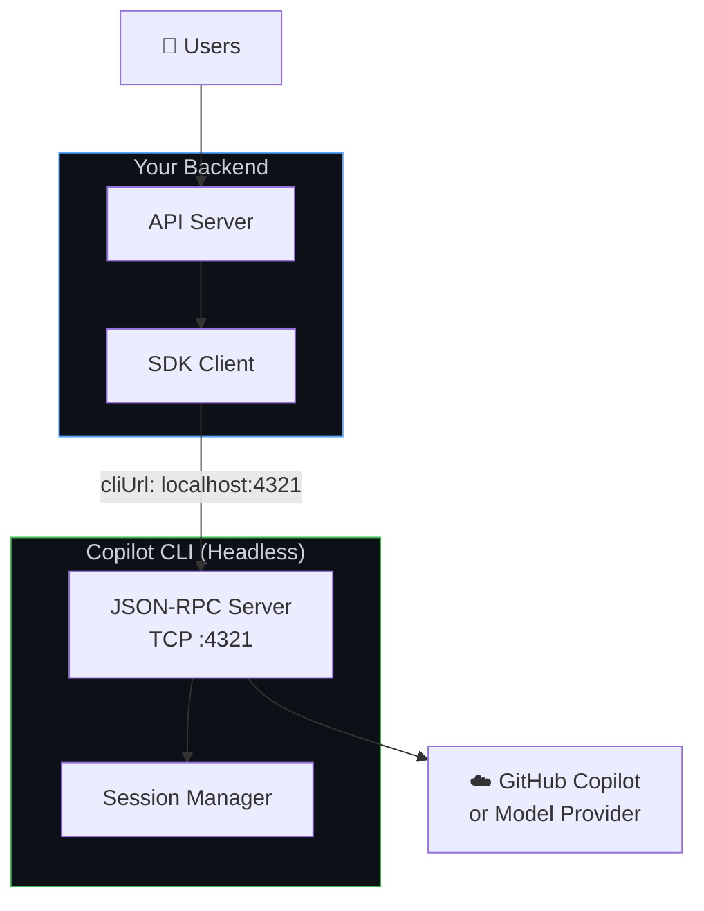
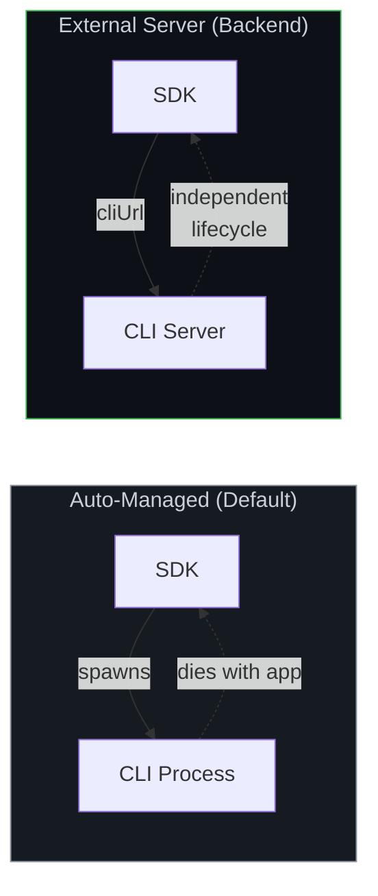
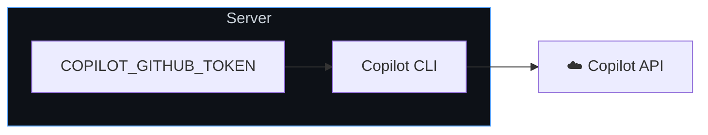
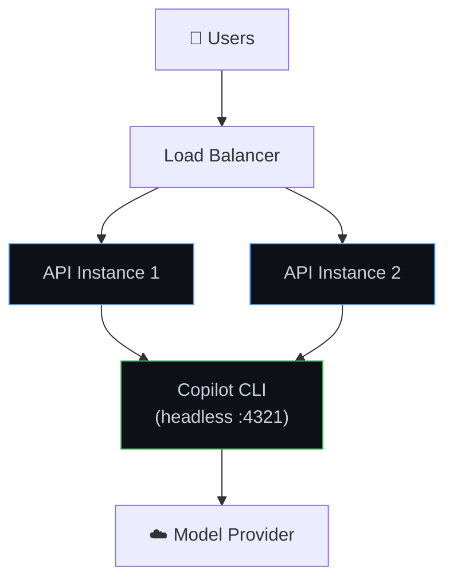
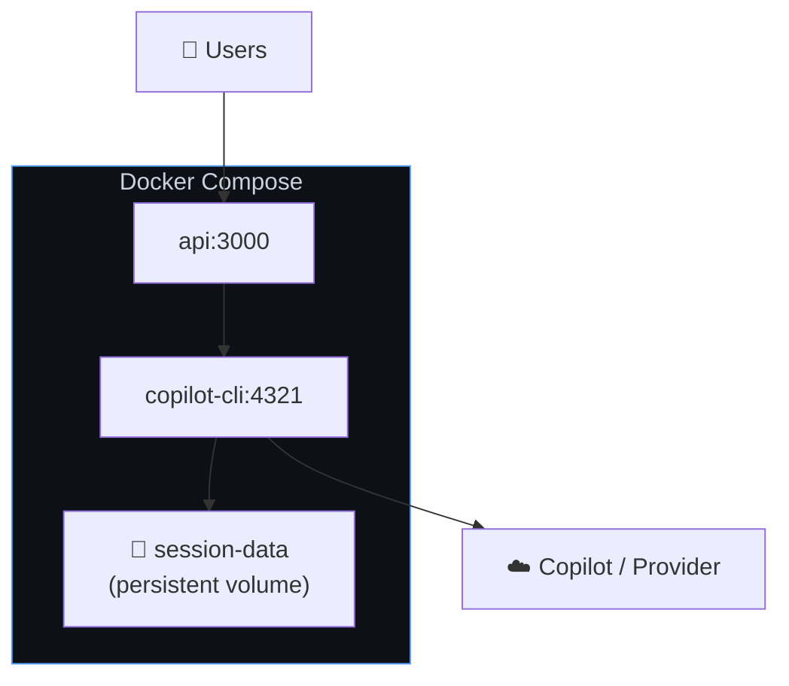

# Backend services setup

Run the Copilot SDK in server-side applications—APIs, web backends, microservices, and background workers. The CLI runs as a headless server that your backend code connects to over the network.

**Best for:** Web app backends, API services, internal tools, CI/CD integrations, any server-side workload.

## How it works

Instead of the SDK spawning a CLI child process, you run the CLI independently in **headless server mode**. Your backend connects to it over TCP using the `Connection` option (`UriConnection`).



**Key characteristics:**
* CLI runs as a persistent server process (not spawned per request)
* SDK connects over TCP—CLI and app can run in different containers
* Multiple SDK clients can share one CLI server
* Works with any auth method (GitHub tokens, env vars, BYOK)

## Architecture: auto-managed vs. external CLI



## Step 1: start the CLI in headless mode

Run the CLI as a background server:

```bash
# Start with a specific port
copilot --headless --port 4321

# Or let it pick a random port (prints the URL)
copilot --headless
# Output: Listening on http://localhost:52431
```

By default the headless server only accepts connections from loopback (`127.0.0.1`). To accept connections from other hosts—for example from another machine on your network—bind to a non-loopback address with `--host`:

```bash
copilot --headless --host 0.0.0.0 --port 4321
```

For production, run it as a system service or in a container.

> [!NOTE]
> There is no official pre-built Docker image for the Copilot CLI. You can build your own from the [GitHub releases](https://github.com/github/copilot-cli/releases):

```dockerfile
FROM debian:bookworm-slim
ARG COPILOT_VERSION=1.0.7
RUN apt-get update \
    && apt-get install -y --no-install-recommends ca-certificates wget \
    && ARCH=$(dpkg --print-architecture) \
    && case "${ARCH}" in amd64) COPILOT_ARCH="x64" ;; arm64) COPILOT_ARCH="arm64" ;; *) echo "Unsupported: ${ARCH}" && exit 1 ;; esac \
    && wget -q "https://github.com/github/copilot-cli/releases/download/v${COPILOT_VERSION}/copilot-linux-${COPILOT_ARCH}.tar.gz" \
    && tar -xzf "copilot-linux-${COPILOT_ARCH}.tar.gz" \
    && mv copilot /usr/local/bin/ \
    && rm "copilot-linux-${COPILOT_ARCH}.tar.gz" \
    && apt-get purge -y wget && apt-get autoremove -y && rm -rf /var/lib/apt/lists/*
ENTRYPOINT ["copilot"]
```

```bash
# Build the image
docker build --build-arg COPILOT_VERSION=1.0.7 -t copilot-cli:latest .

# For remote deployments (Kubernetes, ACI, etc.), push to your registry
docker tag copilot-cli:latest your-registry/copilot-cli:latest
docker push your-registry/copilot-cli:latest
```

```bash
# Docker — must bind to 0.0.0.0 so the container's published port is reachable
docker run -d --name copilot-cli \
    -p 4321:4321 \
    -e COPILOT_GITHUB_TOKEN="$TOKEN" \
    copilot-cli:latest \
    --headless --host 0.0.0.0 --port 4321

# systemd
[Service]
ExecStart=/usr/local/bin/copilot --headless --port 4321
Environment=COPILOT_GITHUB_TOKEN=your-token
Restart=always
```

## Step 2: connect the SDK

<details open>
<summary><strong>Node.js / TypeScript</strong></summary>

```typescript
import { CopilotClient } from "@github/copilot-sdk";

const client = new CopilotClient({
    cliUrl: "localhost:4321",
});

const session = await client.createSession({
    sessionId: `user-${userId}-${Date.now()}`,
    model: "gpt-4.1",
});

const response = await session.sendAndWait({ prompt: req.body.message });
res.json({ content: response?.data.content });
```

</details>

<details>
<summary><strong>Python</strong></summary>

```python
from copilot import CopilotClient, ExternalServerConfig
from copilot.session import PermissionHandler

client = CopilotClient(ExternalServerConfig(url="localhost:4321"))
await client.start()

session = await client.create_session(on_permission_request=PermissionHandler.approve_all, model="gpt-4.1", session_id=f"user-{user_id}-{int(time.time())}")

response = await session.send_and_wait(message)
```

</details>

<details>
<summary><strong>Go</strong></summary>

<!-- docs-validate: hidden -->
```go
package main

import (
	"context"
	"fmt"
	"time"
	copilot "github.com/github/copilot-sdk/go"
)

func main() {
	ctx := context.Background()
	userID := "user1"
	message := "Hello"

	client := copilot.NewClient(&copilot.ClientOptions{
		Connection: copilot.UriConnection{URL: "localhost:4321"},
	})
	client.Start(ctx)
	defer client.Stop()

	session, _ := client.CreateSession(ctx, &copilot.SessionConfig{
		SessionID: fmt.Sprintf("user-%s-%d", userID, time.Now().Unix()),
		Model:     "gpt-4.1",
	})

	response, _ := session.SendAndWait(ctx, copilot.MessageOptions{Prompt: message})
	_ = response
}
```
<!-- /docs-validate: hidden -->

```go
client := copilot.NewClient(&copilot.ClientOptions{
    Connection: copilot.UriConnection{URL: "localhost:4321"},
})
client.Start(ctx)
defer client.Stop()

session, _ := client.CreateSession(ctx, &copilot.SessionConfig{
    SessionID: fmt.Sprintf("user-%s-%d", userID, time.Now().Unix()),
    Model:     "gpt-4.1",
})

response, _ := session.SendAndWait(ctx, copilot.MessageOptions{Prompt: message})
```

</details>

<details>
<summary><strong>.NET</strong></summary>

<!-- docs-validate: hidden -->
```csharp
using GitHub.Copilot;

var userId = "user1";
var message = "Hello";

var client = new CopilotClient(new CopilotClientOptions
{
    Connection = RuntimeConnection.ForUri("localhost:4321"),
});

await using var session = await client.CreateSessionAsync(new SessionConfig
{
    SessionId = $"user-{userId}-{DateTimeOffset.UtcNow.ToUnixTimeSeconds()}",
    Model = "gpt-4.1",
});

var response = await session.SendAndWaitAsync(
    new MessageOptions { Prompt = message });
```
<!-- /docs-validate: hidden -->

```csharp
var client = new CopilotClient(new CopilotClientOptions
{
    Connection = RuntimeConnection.ForUri("localhost:4321"),
});

await using var session = await client.CreateSessionAsync(new SessionConfig
{
    SessionId = $"user-{userId}-{DateTimeOffset.UtcNow.ToUnixTimeSeconds()}",
    Model = "gpt-4.1",
});

var response = await session.SendAndWaitAsync(
    new MessageOptions { Prompt = message });
```

</details>

<details>
<summary><strong>Java</strong></summary>

```java
import com.github.copilot.sdk.CopilotClient;
import com.github.copilot.sdk.events.*;
import com.github.copilot.sdk.json.*;

var userId = "user1";
var message = "Hello!";

var client = new CopilotClient(new CopilotClientOptions()
    .setCliUrl("localhost:4321")
);

try {
    client.start().get();

    var session = client.createSession(new SessionConfig()
        .setSessionId(String.format("user-%s-%d", userId, System.currentTimeMillis() / 1000))
        .setModel("gpt-4.1")
        .setOnPermissionRequest(PermissionHandler.APPROVE_ALL)
    ).get();

    var response = session.sendAndWait(new MessageOptions()
        .setPrompt(message)).get();
} finally {
    client.stop().get();
}
```

</details>

## Authentication for backend services

### Environment variable tokens

The simplest approach—set a token on the CLI server:



```bash
# All requests use this token
export COPILOT_GITHUB_TOKEN="gho_service_account_token"
copilot --headless --port 4321
```

### Per-user tokens (OAuth)

Pass individual user tokens when creating sessions. See [GitHub OAuth](./github-oauth.md) for the full flow.

```typescript
// Your API receives user tokens from your auth layer
app.post("/chat", authMiddleware, async (req, res) => {
    const client = new CopilotClient({
        cliUrl: "localhost:4321",
        gitHubToken: req.user.githubToken,
        useLoggedInUser: false,
    });

    const session = await client.createSession({
        sessionId: `user-${req.user.id}-chat`,
        model: "gpt-4.1",
    });

    const response = await session.sendAndWait({
        prompt: req.body.message,
    });

    res.json({ content: response?.data.content });
});
```

### BYOK (no GitHub auth)

Use your own API keys for the model provider. See [BYOK](../auth/byok.md) for details.

```typescript
const client = new CopilotClient({
    cliUrl: "localhost:4321",
});

const session = await client.createSession({
    model: "gpt-4.1",
    provider: {
        type: "openai",
        baseUrl: "https://api.openai.com/v1",
        apiKey: process.env.OPENAI_API_KEY,
    },
});
```

## Common backend patterns

### Web API with Express



```typescript
import express from "express";
import { CopilotClient } from "@github/copilot-sdk";

const app = express();
app.use(express.json());

// Single shared CLI connection
const client = new CopilotClient({
    cliUrl: process.env.CLI_URL || "localhost:4321",
});

app.post("/api/chat", async (req, res) => {
    const { sessionId, message } = req.body;

    // Create or resume session
    let session;
    try {
        session = await client.resumeSession(sessionId);
    } catch {
        session = await client.createSession({
            sessionId,
            model: "gpt-4.1",
        });
    }

    const response = await session.sendAndWait({ prompt: message });
    res.json({
        sessionId,
        content: response?.data.content,
    });
});

app.listen(3000);
```

### Background worker

```typescript
import { CopilotClient } from "@github/copilot-sdk";

const client = new CopilotClient({
    cliUrl: process.env.CLI_URL || "localhost:4321",
});

// Process jobs from a queue
async function processJob(job: Job) {
    const session = await client.createSession({
        sessionId: `job-${job.id}`,
        model: "gpt-4.1",
    });

    const response = await session.sendAndWait({
        prompt: job.prompt,
    });

    await saveResult(job.id, response?.data.content);
    await session.disconnect();  // Clean up after job completes
}
```

### Docker compose deployment

```yaml
version: "3.8"

services:
  copilot-cli:
    image: copilot-cli:latest  # See "Step 1" above for how to build this image
    command: ["--headless", "--host", "0.0.0.0", "--port", "4321"]
    environment:
      - COPILOT_GITHUB_TOKEN=${COPILOT_GITHUB_TOKEN}
    ports:
      - "4321:4321"
    restart: always
    volumes:
      - session-data:/root/.copilot/session-state

  api:
    build: .
    environment:
      - CLI_URL=copilot-cli:4321
    depends_on:
      - copilot-cli
    ports:
      - "3000:3000"

volumes:
  session-data:
```



## Health checks

Monitor the CLI server's health:

```typescript
// Periodic health check
async function checkCLIHealth(): Promise<boolean> {
    try {
        const status = await client.getStatus();
        return status !== undefined;
    } catch {
        return false;
    }
}
```

## Session cleanup

Backend services should actively clean up sessions to avoid resource leaks:

```typescript
// Clean up expired sessions periodically
async function cleanupSessions(maxAgeMs: number) {
    const sessions = await client.listSessions();
    const now = Date.now();

    for (const session of sessions) {
        const age = now - new Date(session.createdAt).getTime();
        if (age > maxAgeMs) {
            await client.deleteSession(session.sessionId);
        }
    }
}

// Run every hour
setInterval(() => cleanupSessions(24 * 60 * 60 * 1000), 60 * 60 * 1000);
```

## Limitations

| Limitation | Details |
|------------|---------|
| **Single CLI server = single point of failure** | See [Scaling guide](./scaling.md) for HA patterns |
| **No built-in auth between SDK and CLI** | Secure the network path (same host, VPC, etc.) |
| **Session state on local disk** | Mount persistent storage for container restarts |
| **30-minute idle timeout** | Sessions without activity are auto-cleaned |

## When to move on

| Need | Next Guide |
|------|-----------|
| Multiple CLI servers / high availability | [Scaling & Multi-Tenancy](./scaling.md) |
| GitHub account auth for users | [GitHub OAuth](./github-oauth.md) |
| Your own model keys | [BYOK](../auth/byok.md) |

## Next steps

* **[Scaling & Multi-Tenancy](./scaling.md)**: Handle more users, add redundancy
* **[Session Persistence](../features/session-persistence.md)**: Resume sessions across restarts
* **[GitHub OAuth](./github-oauth.md)**: Add user authentication
