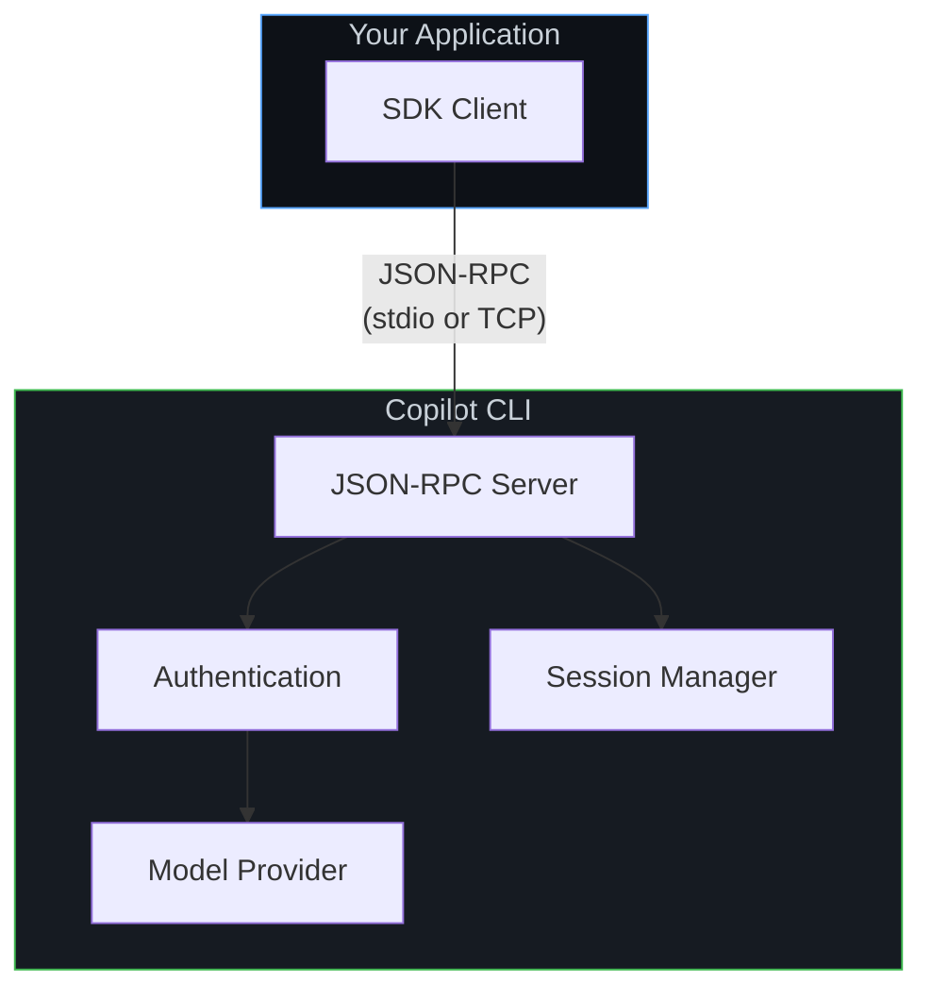
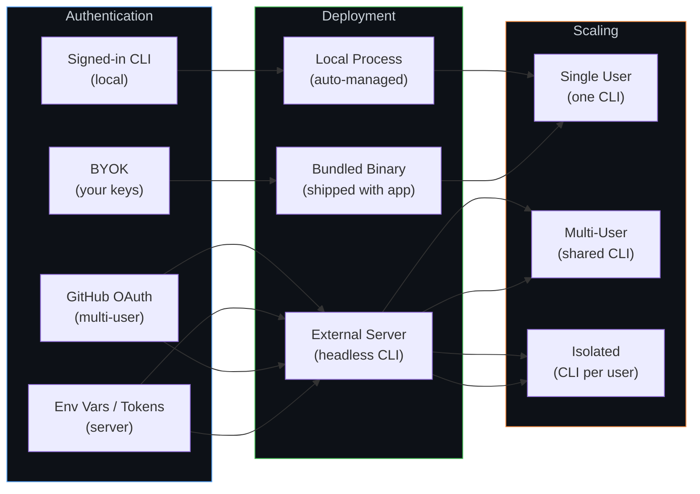

# Setup guides

These guides walk you through configuring the Copilot SDK for your specific use case—from personal side projects to production platforms serving thousands of users.

## Architecture at a glance

Every Copilot SDK integration follows the same core pattern: your application talks to the SDK, which communicates with the Copilot CLI over JSON-RPC. What changes across setups is **where the CLI runs**, **how users authenticate**, and **how sessions are managed**.

The setup guides below help you configure each layer for your scenario.

## Who are you?

### 🧑‍💻 Hobbyist

You're building a personal assistant, side project, or experimental app. You want the simplest path to getting Copilot in your code.

**Start with:**
1. **[Default Setup](./bundled-cli.md)**—The SDK includes the CLI automatically—just install and go
1. **[Local CLI](./local-cli.md)**—Use your own CLI binary or running instance (advanced)

### 🏢 Internal app developer

You're building tools for your team or company. Users are employees who need to authenticate with their enterprise GitHub accounts or org memberships.

**Start with:**
1. **[GitHub OAuth](./github-oauth.md)**—Let employees sign in with their GitHub accounts
1. **[Backend Services](./backend-services.md)**—Run the SDK in your internal services

**If scaling beyond a single server:**
1. **[Multi-tenancy and server deployments](./multi-tenancy.md)**—Configure SDK options for multi-user server mode
1. **[Scaling & Multi-Tenancy](./scaling.md)**—Handle multiple users and services

### 🚀 App developer (ISV)

You're building a product for customers. You need to handle authentication for your users—either through GitHub or by managing identity yourself.

**Start with:**
1. **[GitHub OAuth](./github-oauth.md)**—Let customers sign in with GitHub
1. **[BYOK](../auth/byok.md)**—Manage identity yourself with your own model keys
1. **[Backend Services](./backend-services.md)**—Power your product from server-side code

**For production:**
1. **[Multi-tenancy and server deployments](./multi-tenancy.md)**—Use `mode: "empty"`, per-session tokens, and isolated runtime state
1. **[Scaling & Multi-Tenancy](./scaling.md)**—Serve many customers reliably

### 🏗️ Platform developer

You're embedding Copilot into a platform—APIs, developer tools, or infrastructure that other developers build on. You need fine-grained control over sessions, scaling, and multi-tenancy.

**Start with:**
1. **[Backend Services](./backend-services.md)**—Core server-side integration
1. **[Multi-tenancy and server deployments](./multi-tenancy.md)**—SDK-level isolation, per-session auth, and shared runtime options
1. **[Scaling & Multi-Tenancy](./scaling.md)**—Session isolation, horizontal scaling, persistence

**Depending on your auth model:**
1. **[GitHub OAuth](./github-oauth.md)**—For GitHub-authenticated users
1. **[BYOK](../auth/byok.md)**—For self-managed identity and model access

## Decision matrix

Use this table to find the right guides based on what you need to do:

| What you need | Guide |
|---------------|-------|
| Getting started quickly | [Default Setup (Bundled CLI)](./bundled-cli.md) |
| Use your own CLI binary or server | [Local CLI](./local-cli.md) |
| Users sign in with GitHub | [GitHub OAuth](./github-oauth.md) |
| Use your own model keys (OpenAI, Azure, and more) | [BYOK](../auth/byok.md) |
| Azure BYOK with Managed Identity (no API keys) | [Azure Managed Identity](./azure-managed-identity.md) |
| Run the SDK on a server | [Backend Services](./backend-services.md) |
| Configure SDK options for concurrent users | [Multi-tenancy and server deployments](./multi-tenancy.md) |
| Serve multiple users / scale horizontally | [Scaling & Multi-Tenancy](./scaling.md) |

## Configuration comparison

## Prerequisites

All guides assume you have:

* **One of the SDKs** installed (Node.js, Python, and .NET SDKs include the CLI automatically):
  * Node.js: `npm install @github/copilot-sdk`
  * Python: `pip install github-copilot-sdk`
  * Go: `go get github.com/github/copilot-sdk/go` (requires separate CLI installation)
  * .NET: `dotnet add package GitHub.Copilot.SDK`

If you're brand new, start with the **[Getting Started tutorial](../getting-started.md)** first, then come back here for production configuration.

## Next steps

Pick the guide that matches your situation from the [decision matrix](#decision-matrix) above, or start with the persona description closest to your role.
